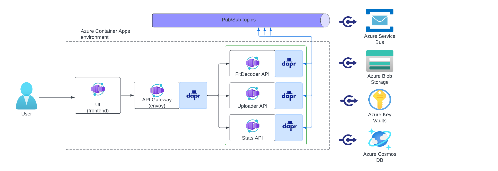

# Mover

This repository was created to understand modular monolithic architecture as sample application to Azure Container Apps.

Azure Container Apps is a managed serverless container offering for building and deploying modern apps at scale. It enables developers to deploy containerized apps without managing container orchestration. This sample makes use of the Distributed Application Runtime (Dapr), which is integrated deeply into the container apps platform.

Dapr is a CNCF project that helps developers overcome the inherent challenges presented by distributed applications, such as state management and service invocation. Container Apps also provides a fully-managed integration with the Kubernetes Event Driven Autoscaler (KEDA). KEDA allows your containers to autoscale based on incoming events from external services such Azure Service Bus or Redis.

## High-Level Overview of the application

## Deploy via GitHub Actions

[Click here for instructions on building and running the application on Azure](deploy-via-github-actions.md)
